# Proposta — Esquema de cadastros de referência (pessoas, núcleos, canais/URC, projetos)

> Status: **proposta em aberto** — nada abaixo foi executado no banco.
> Documento único — incorpora e substitui por completo a primeira versão desta
> proposta (que olhava só pessoas, antes do pedido crescer pra "toda tabela de gestão
> e de referência"). Duas decisões já fechadas em 22/08/2026, marcadas abaixo.

## O problema, com números — pessoas é o caso mais grave

Antes de ir pro desenho geral, vale isolar o diagnóstico de pessoas, porque é o que
tem os números mais concretos. Hoje "pessoa" não tem identidade única no banco — vale
rastrear todas as fontes onde um nome de pessoa aparece, porque nenhuma delas se
enxerga:

| Fonte | Linhas | Gente física distinta | Tem FK pra outra tabela? |
|---|---|---|---|
| `meta_inovacao_pessoas` | 20 | 13 (7 nomes duplicados entre grupo "Comitê" e "Núcleos") | Não |
| `meta_inovacao_projetos.representantes` (`text[]`) | 34 instâncias | 13 pessoas que **não têm nenhuma linha própria** em `meta_inovacao_pessoas` (Carol, Fred, Thiago, Raquel, Dario, Rafa, Cris, Wébia, Jéssica, Fernanda, Agnaldo, Valéria, Felipe) + placeholder intencional "Núcleo de Startups" | Não (coluna é `text[]`) |
| `meta_inovacao_urc_lideranca` | 3 (Enio, Milva, Iuri) | 3 | Não |
| `meta_inovacao_urc_canais_responsaveis` | 11 | 11 | Não (`canal` também é texto livre, comentário no schema confirma: "não é FK") |
| `meta_inovacao_plano_acoes.responsavel_id` (`text[]`) | — | resolve contra `window.DB.responsaveis` (lista estática, mistura pessoa + coletivo: "jr", "comite", "gestores") | Não |

Somando e removendo sobreposição: **~40 pessoas físicas distintas espalhadas em 4
tabelas**, nenhuma delas apontando pra uma raiz comum. A ligação hoje é feita por
*casamento de texto*: `js/responsaveis.js` normaliza acento/maiúscula e usa uma tabela
de aliases pra decidir que "Gabriel" (em `representantes`) é a mesma pessoa que
"Gabriel Gil Barreto Barros" (em `meta_inovacao_pessoas`). Funciona, mas é frágil — e é
por isso que o Schema Visualizer do Supabase não desenha nenhuma linha ligando
`pessoas` a `projetos`/núcleos: não existe *constraint*, só convenção de nome.

Sintoma concreto disso já existir: `tools/testar_guardrail_urc_supabase.js` roda uma
query própria só pra impedir que o mesmo nome apareça em `urc_lideranca` **e** em
`urc_canais_responsaveis` ao mesmo tempo — um teste existe hoje pra compensar a
ausência de uma identidade compartilhada. Com golden record, isso vira constraint (ou
deixa de fazer sentido como preocupação), não um teste rodando contra nome digitado.

## Princípio orientador: cadastrar um valor novo faz ele aparecer sozinho

Isto é o requisito central deste pedido, então vale deixar explícito o que significa
na prática, com os limites certos (pra não prometer o que não faz sentido):

- **O que passa a ser automático:** todo `<select>`/checkbox/coluna de grade que hoje é
  uma lista fixa (array no JS, `<option>` escrito na mão, ou — o caso mais grave —
  uma **coluna física da tabela**) passa a ser montado, na hora de carregar a tela, a
  partir de uma tabela-catálogo no Supabase (mesmo padrão de `DB_PROJETOS.carregar()`
  que vocês já usam). Cadastrar um núcleo/canal/pessoa novo na tela de administração
  certa faz esse valor aparecer em **todo lugar que o lê**, sem deploy e sem `ALTER
  TABLE` — porque a lista deixou de estar embutida no código ou no schema.
- **O que continua manual, corretamente:** o valor aparecer *disponível pra escolher*
  é automático; o **ato de escolher** continua sendo humano. Cadastrar o canal
  "Newsletter" faz ele aparecer no dropdown de canal da oficina e na grade da matriz de
  demandas — não cria sozinho um encontro de agenda pra esse canal, porque agendar um
  encontro é uma decisão, não uma consequência de o canal existir.
- **O único lugar do banco de vocês hoje que VIOLA esse princípio de propósito:**
  `meta_inovacao_matriz_demandas` tem uma coluna física por canal (`foco`, `cnr`,
  `portal`, `mkt`...). Cadastrar um canal novo aí não é um `INSERT` — é um `ALTER TABLE
  ADD COLUMN` mais mudança de código em `demandas.html`/`editor.html`. É a única tabela
  do levantamento inteiro que precisa ser **redesenhada** (não só ganhar uma FK) pra
  cumprir o que você pediu. Detalho isso na seção própria mais abaixo.

---

## Inventário — onde hoje um "valor de referência" é texto livre ou coluna fixa

| Tabela | Campo | Hoje | Devia virar |
|---|---|---|---|
| `meta_inovacao_pessoas` | `grupo`, `nucleo`, `papel` | texto, linha duplicada por grupo | junção `pessoa_papeis` (nucleo_id FK) |
| `meta_inovacao_projetos` | `nucleo` | texto | `+ nucleo_id` FK |
| `meta_inovacao_projetos` | `representantes` | `text[]` | junção `projeto_representantes` (pessoa_id FK) |
| `meta_inovacao_urc_lideranca` | `nome`/`papel`/`email` | texto solto | `+ pessoa_id` FK |
| `meta_inovacao_urc_canais_responsaveis` | `canal` | texto, "lista fixa no client, não é FK" (comentário no próprio schema) | `+ canal_id` FK |
| `meta_inovacao_urc_canais_responsaveis` | `nome`/`email` | texto solto | `+ pessoa_id` FK |
| `meta_inovacao_plano_acoes` | `responsavel_id` | `text[]` resolvido por alias em `js/responsaveis.js` | junção `plano_responsaveis` (pessoa/coletivo) |
| `meta_inovacao_agenda_encontros` | `canal` | texto, "id do canal (data/canais.js)" | `+ canal_id` FK |
| `meta_inovacao_canva_demandas` | `nucleo` | texto, preenchido por função quando projeto casa | `+ nucleo_id` FK |
| `meta_inovacao_canva_demandas` | `canal` | texto, "id de data/canais.js — whitelist" | `+ canal_id` FK |
| `meta_inovacao_canva_demandas` | `facilitador` | texto livre | `+ facilitador_pessoa_id` FK nullable |
| `meta_inovacao_canva_demandas` | `responsavel` | texto livre | `+ responsavel_pessoa_id` FK nullable |
| `meta_inovacao_matriz_demandas` | `iniciativa` | texto, `unique`, sem FK | vira `projeto_id` FK na tabela nova (ver abaixo) |
| `meta_inovacao_matriz_demandas` | `foco`,`cnr`,`empresa`,`portal`,`mkt`,`loja`,`rede`,`assessoria`,`dxp`,`contab` | **10 colunas físicas**, uma por canal | vira `canal_id` FK + `estado`, uma linha por célula |
| `corsario_status` | `iniciativa` | texto (28 valores; 1 a mais que os 27 do golden record — a divergência que `testar_iniciativas_cruzado.js` existe pra pegar) | `+ projeto_id` FK nullable |
| `corsario_status` | `nucleo` | texto | `+ nucleo_id` FK nullable |
| `corsario_status` | `criterio` | **já é FK** → `corsario_criterios.chave` | nada a fazer — é o único caso do projeto que já segue o padrão certo |

Reparem que `corsario_criterios` (chave/rótulo/grupo/ordem, com FK real vindo de
`corsario_status.criterio`) já é exatamente o formato de catálogo que esta proposta
generaliza pra núcleo, canal, pessoa e coletivo — não é um conceito novo no projeto,
é estender pro resto o que já existe num canto dele.

---

## Catálogos centrais propostos

### `meta_inovacao_nucleos`
`id` PK, `nome` (unique), `ordem`, padrão de auditoria/soft-delete. Seed: os 5 núcleos
atuais.

### `meta_inovacao_canais`
`id` PK, `nome`, `nome_completo`, `formato`, `pauta` (jsonb, lista de linhas), `ordem`,
`ativo`, padrão de auditoria/soft-delete.
Unifica **duas listas que hoje vivem separadas e precisam ser mantidas em sincronia na
mão**: `data/canais.js` (10 canais, usado por `apresentacao_canais.html`/`qrcodes.html`)
e a constante `CANAIS_URC` do client (8 canais, usado por `urc_canais_responsaveis` e
`urc_lideranca`) — as duas descrevem o mesmo conceito (canal de relacionamento com o
Sebrae), só que a segunda ainda não inclui os 2 canais mais novos ("Sebrae na sua
empresa", "Contabilizações e instrumentos") por não terem responsável de URC definido
ainda — o que é exatamente o tipo de "ainda não preenchido" que uma FK nullable resolve
sem precisar de duas listas.

### `meta_inovacao_pessoas` (evolução da atual — mesmo desenho da proposta anterior)
Ganha `nome_completo`, `nome_exibicao`, `email`, `ativo`; perde `papel`/`grupo`/`nucleo`
pra `meta_inovacao_pessoa_papeis`.

### `meta_inovacao_coletivos`
`id` PK, `nome` ("Comitê", "URC", "Coordenadores", "Gestores dos projetos", "Soluções"),
`ordem`, padrão de auditoria/soft-delete. Tabela separada de `meta_inovacao_pessoas`
(decidido 22/08 — ver "Decisões" mais abaixo).

### `meta_inovacao_projetos` (já existe — golden record de projetos)
Ganha `nucleo_id` FK (convive com `nucleo` texto).

### `corsario_criterios` (já existe — nada muda)

---

## Tabelas de vínculo (relações N:N)

| Tabela | Liga | Colunas-chave |
|---|---|---|
| `meta_inovacao_pessoa_papeis` | pessoa ↔ contexto/núcleo | `pessoa_id`, `contexto` (UI/Comite/Nucleo), `nucleo_id` nullable, `papel` |
| `meta_inovacao_projeto_representantes` | projeto ↔ pessoa | `projeto_id`, `pessoa_id`, `ordem` |
| `meta_inovacao_urc_canal_responsaveis` | canal ↔ pessoa | `canal_id`, `pessoa_id`, `ordem` (evolução de `urc_canais_responsaveis`, que troca `canal` texto por `canal_id`) |
| `meta_inovacao_plano_responsaveis` | ação do plano ↔ pessoa OU coletivo | `plano_acao_id`, `pessoa_id` nullable, `coletivo_id` nullable, `CHECK` exatamente um preenchido |

---

## A mudança maior: normalizar `meta_inovacao_matriz_demandas`

Hoje: **1 linha por iniciativa, 1 coluna por canal** (10 colunas fixas, cada uma com um
`CHECK IN (...)` de estado). Pra adicionar um canal, alguém precisa rodar `ALTER TABLE
... ADD COLUMN` e mexer no HTML de `demandas.html`/`editor.html` que lista as colunas
na mão. É o oposto de "cadastra e aparece sozinho".

**Proposta: `meta_inovacao_matriz_celulas`** (substitui a tabela atual)

| coluna | tipo | nota |
|---|---|---|
| `id` | bigint identity, PK | |
| `projeto_id` | bigint FK → `meta_inovacao_projetos(id)` not null | no lugar de `iniciativa text` |
| `canal_id` | bigint FK → `meta_inovacao_canais(id)` not null | no lugar da coluna física |
| `estado` | text, mesmo `CHECK` de hoje (`'', previsto, oficina, formulario, justificado, priorizado, encaminhado`) | |
| `atualizado_em` / `atualizado_por` | padrão | |
| — | `UNIQUE (projeto_id, canal_id)` | uma célula por par |

Com isto: célula ausente = vazia (não precisa inserir linha pra cada combinação —
`demandas.html` monta a grade iterando `meta_inovacao_projetos` × `meta_inovacao_canais`
e preenchendo com o que encontrar). Cadastrar o canal 11 vira **um INSERT em
`meta_inovacao_canais`**, e a grade inteira já nasce com essa coluna, pra todo projeto,
sem tocar em schema nem em HTML de opções.

Esta é a camada de maior risco técnico da proposta inteira — não pelo desenho da
tabela, que é simples, mas porque `demandas.html`/`editor.html` precisam trocar de
"colunas fixas no HTML" pra "grade montada em JS a partir do catálogo". A tabela atual
usa uma policy de RLS *diferente* do padrão do resto do projeto (`FOR ALL TO anon
USING (true)` — sem token de escrita, ao contrário de `cc_token_insert`/
`cc_token_update` do restante); **decidido (22/08): a tabela nova mantém essa mesma
policy aberta**, não migra pro padrão de token.

---

## Tabelas operacionais que ganham FK (convivendo com o texto atual)

- **`meta_inovacao_urc_lideranca`**: `+ pessoa_id` FK nullable.
- **`meta_inovacao_agenda_encontros`**: `+ canal_id` FK nullable (mantém `canal` texto).
- **`meta_inovacao_canva_demandas`**: `+ nucleo_id`, `+ canal_id`, `+ facilitador_pessoa_id`,
  `+ responsavel_pessoa_id`, todas FK nullable. Mantém as colunas de texto — inclusive
  isso já é o padrão que a própria tabela usa pra `projeto`/`projeto_digitado`/
  `projeto_id` (guarda o cru pra auditoria e o canônico pra consulta); só está sendo
  estendido pros outros 4 campos que hoje não têm esse tratamento.
- **`corsario_status`**: `+ projeto_id` FK nullable, `+ nucleo_id` FK nullable. Com
  `projeto_id`, a divergência 27×28 (que hoje só um teste JS pega,
  `tools/testar_iniciativas_cruzado.js`) vira uma pergunta de SQL direta: `SELECT *
  FROM corsario_status WHERE projeto_id IS NULL` mostra exatamente a linha órfã, sem
  depender de rodar o teste.

---

## Diagrama de relacionamento — esquema completo pós-implementação

```mermaid
erDiagram
  meta_inovacao_nucleos {
    bigint id PK
    text nome
  }
  meta_inovacao_canais {
    bigint id PK
    text nome
    text nome_completo
    boolean ativo
  }
  meta_inovacao_coletivos {
    bigint id PK
    text nome
  }
  meta_inovacao_pessoas {
    bigint id PK
    text nome_completo
    text nome_exibicao
    text email
    boolean ativo
    boolean pendente
  }
  meta_inovacao_pessoa_papeis {
    bigint id PK
    bigint pessoa_id FK
    text contexto
    bigint nucleo_id FK
    text papel
  }
  meta_inovacao_projetos {
    bigint id PK
    bigint nucleo_id FK
    text iniciativa
  }
  meta_inovacao_projeto_representantes {
    bigint id PK
    bigint projeto_id FK
    bigint pessoa_id FK
  }
  meta_inovacao_matriz_celulas {
    bigint id PK
    bigint projeto_id FK
    bigint canal_id FK
    text estado
  }
  meta_inovacao_urc_lideranca {
    bigint id PK
    bigint pessoa_id FK
    text papel
  }
  meta_inovacao_urc_canal_responsaveis {
    bigint id PK
    bigint canal_id FK
    bigint pessoa_id FK
  }
  meta_inovacao_agenda_encontros {
    bigint id PK
    bigint canal_id FK
    int ciclo
  }
  meta_inovacao_canva_demandas {
    bigint id PK
    bigint projeto_id FK
    bigint nucleo_id FK
    bigint canal_id FK
    bigint facilitador_pessoa_id FK
    bigint responsavel_pessoa_id FK
  }
  meta_inovacao_plano_acoes {
    bigint id PK
    text atividade
  }
  meta_inovacao_plano_responsaveis {
    bigint id PK
    bigint plano_acao_id FK
    bigint pessoa_id FK
    bigint coletivo_id FK
  }
  corsario_status {
    bigint id PK
    bigint projeto_id FK
    bigint nucleo_id FK
    text criterio FK
  }
  corsario_criterios {
    text chave PK
    text rotulo
  }

  meta_inovacao_pessoas ||--o{ meta_inovacao_pessoa_papeis : pessoa_id
  meta_inovacao_nucleos ||--o{ meta_inovacao_pessoa_papeis : "nucleo_id (se Nucleo)"

  meta_inovacao_nucleos ||--o{ meta_inovacao_projetos : nucleo_id
  meta_inovacao_pessoas ||--o{ meta_inovacao_projeto_representantes : pessoa_id
  meta_inovacao_projetos ||--o{ meta_inovacao_projeto_representantes : projeto_id

  meta_inovacao_projetos ||--o{ meta_inovacao_matriz_celulas : projeto_id
  meta_inovacao_canais ||--o{ meta_inovacao_matriz_celulas : canal_id

  meta_inovacao_pessoas ||--o{ meta_inovacao_urc_lideranca : pessoa_id
  meta_inovacao_canais ||--o{ meta_inovacao_urc_canal_responsaveis : canal_id
  meta_inovacao_pessoas ||--o{ meta_inovacao_urc_canal_responsaveis : pessoa_id

  meta_inovacao_canais ||--o{ meta_inovacao_agenda_encontros : canal_id

  meta_inovacao_projetos ||--o{ meta_inovacao_canva_demandas : projeto_id
  meta_inovacao_nucleos ||--o{ meta_inovacao_canva_demandas : nucleo_id
  meta_inovacao_canais ||--o{ meta_inovacao_canva_demandas : canal_id
  meta_inovacao_pessoas ||--o{ meta_inovacao_canva_demandas : "facilitador_pessoa_id / responsavel_pessoa_id"

  meta_inovacao_plano_acoes ||--o{ meta_inovacao_plano_responsaveis : plano_acao_id
  meta_inovacao_pessoas ||--o{ meta_inovacao_plano_responsaveis : "pessoa_id (nullable)"
  meta_inovacao_coletivos ||--o{ meta_inovacao_plano_responsaveis : "coletivo_id (nullable)"

  meta_inovacao_projetos ||--o{ corsario_status : "projeto_id (nullable)"
  meta_inovacao_nucleos ||--o{ corsario_status : "nucleo_id (nullable)"
  corsario_criterios ||--o{ corsario_status : criterio
```

---

## Exemplos concretos do "cadastra e aparece sozinho", tela por tela

- **Cadastra um núcleo novo** (aba nova "Núcleos" em `editor.html`) → aparece no
  seletor de núcleo em "Projetos & Representantes", no seletor de núcleo de
  "Pessoas", e em qualquer filtro por núcleo que hoje é lista fixa (`index.html`,
  `participantes.html`).
- **Cadastra um canal novo** (aba nova "Canais") → aparece: no seletor de canal da
  oficina (`canva.html`), no seletor de canal em "URC — Responsáveis por canal", como
  coluna nova na grade de `demandas.html` (depois da Camada 3), e como opção de canal
  ao cadastrar um encontro em `agenda.html` — sem precisar cadastrar o encontro
  sozinho, que continua sendo um ato manual de quem monta a agenda.
- **Cadastra uma pessoa nova** (aba "Pessoas") → aparece nos seletores de
  representante de projeto, responsável de plano de ação, liderança/canal da URC —
  em qualquer tela que hoje monta a lista a partir de `DB_PESSOAS.carregar()`.
- **Cadastra um coletivo novo** (em `meta_inovacao_coletivos`) → aparece só onde
  "responsável" aceita coletivo (plano de ação), não em "representante de projeto"
  (que continua exigindo pessoa física).

Nenhuma tela nova é obrigatória — todas já existem hoje em `editor.html` (`CONJUNTOS`)
e nas outras páginas do site; o que muda é o que cada uma lê/grava:

- **`editor.html` → aba "Pessoas"** vira o CRUD de verdade de `meta_inovacao_pessoas` +
  `meta_inovacao_pessoa_papeis` (mesmo papel que "Projetos & Representantes" já tem pro
  golden record de projetos).
- **`editor.html` → abas "Projetos & Representantes", "URC — Liderança", "URC —
  Responsáveis por canal"** trocam texto livre por seletor de pessoa/núcleo/canal.
- **`plano-acao.html` / `minhas-acoes.html`** — select de "Responsável" passa a listar
  `meta_inovacao_pessoas` + `meta_inovacao_coletivos`, no lugar de
  `window.DB.responsaveis` e do parsing de `js/responsaveis.js`.
- **`participantes.html`, `js/drawer.js`** passam a exibir `nome_completo`/
  `nome_exibicao`/`papel` vindos de um join, não de um array de string.
- **`agenda.html`** (campo "guardião" dos Nós, ex. "JR. e gestores + Comitê") — mesmo
  padrão do responsável do plano; resolver por completo pediria uma junção
  `meta_inovacao_no_guardioes` — sinalizo como possível camada extra, não obrigatória
  pro objetivo principal (o texto livre aqui é mais narrativo que "campo de sistema").

---

## Decisões — fechadas em 22/08/2026

**Coletivos: Opção A.** "Comitê"/"URC"/os demais coletivos ficam em
`meta_inovacao_coletivos`, separada de `meta_inovacao_pessoas` — não entram como linha
de pessoa com um campo `tipo`. `meta_inovacao_plano_responsaveis` mantém as duas FKs
nullable (`pessoa_id`/`coletivo_id`) com o `CHECK` de exatamente uma preenchida, como
desenhado.

**RLS de `meta_inovacao_matriz_celulas`: igual a hoje.** A tabela nova herda a policy
totalmente aberta (`FOR ALL TO anon USING (true)`) que `meta_inovacao_matriz_demandas`
já tem — **não** passa a exigir `x-cc-token`. Só a estrutura muda (wide → long); o
nível de proteção da escrita fica como está.

---

## Plano de implementação (camadas)

1. **Camada 0 — catálogos-base.** `meta_inovacao_nucleos`, `meta_inovacao_canais`
   (migrando `data/canais.js` + `CANAIS_URC`), `meta_inovacao_coletivos`.
2. **Camada 1 — golden record de pessoas.** `meta_inovacao_pessoas` evolui (ganha
   `nome_completo`, `nome_exibicao`, `email`, `ativo`; perde `papel`/`grupo`/`nucleo`
   pra `meta_inovacao_pessoa_papeis`); dedupe das ~40 pessoas das 4 fontes num conjunto
   único — manual, guiado por nome (nomes curtos como "Carol" precisam de confirmação
   humana de qual "Carol" é, não dá pra automatizar com segurança).
3. **Camada 2 — FK pontual, convivendo com o texto.** Todos os `ALTER ADD COLUMN`
   nullable listados (projetos, urc_lideranca, urc_canal_responsaveis, canva_demandas,
   corsario_status) + as junções `meta_inovacao_projeto_representantes` e
   `meta_inovacao_plano_responsaveis`. Populados a partir do texto existente, resolvendo
   pelos mesmos aliases que `js/responsaveis.js` já conhece.
4. **Camada 3 — normalizar a matriz de demandas.** Cria
   `meta_inovacao_matriz_celulas`, migra as 10 colunas fixas pra linhas, reescreve
   `demandas.html`/`editor.html` pra montar a grade a partir de
   `meta_inovacao_canais.carregar()`. Maior risco técnico do pacote — fazer por último
   entre as mudanças de dado, com a tabela antiga preservada até a nova estar
   validada em produção.
5. **Camada 4 — telas passam a gravar via FK.** Seletores substituem texto livre nas
   abas do `editor.html` e nos formulários de oficina/plano de ação.
6. **Camada 5 — aposentar texto livre remanescente**, review por review, depois de
   cada camada estar verificada em produção.

Todas seguem `tools/sql/PADRAO_TABELA.md` (prefixo, RLS com token, soft delete,
trigger de `updated_at`, `NOTIFY pgrst` em `ALTER` de tabela existente, auditoria nas
tabelas "editáveis de verdade").

## O que NÃO está nesta proposta

- Nenhum SQL foi rodado — isto é só o desenho, mesmo com as duas decisões já fechadas.
- Não mexe em `meta_inovacao_editores` (login de edição via `auth.users`).
