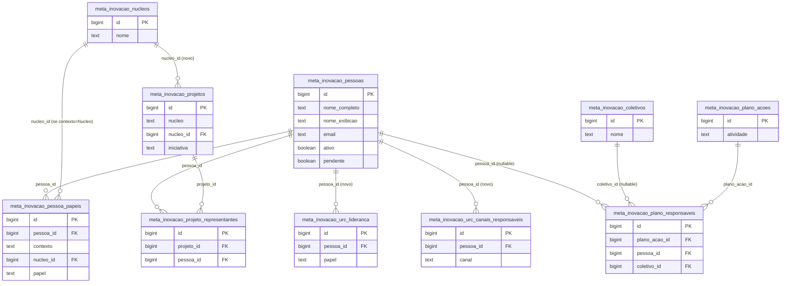

# Proposta — Golden record de Pessoas (módulo ADM)

> Status: **proposta em aberto** — nada abaixo foi executado no banco. Só depois de
> aprovado isto vira migração SQL (mesmo formato de `2026-08_migracao_modo_edicao.sql`),
> seguindo `tools/sql/PADRAO_TABELA.md`.
>
> **Ampliada em 22/08/2026** por `PROPOSTA_ESQUEMA_CADASTROS_REFERENCIA.md` — aquele
> doc cobre núcleos, canais/URC e projetos além de pessoas, e é a referência mais
> atual. Este arquivo continua valendo como o detalhamento de pessoas especificamente
> (dedupe das ~40 pessoas, `pessoa_papeis`, decisão A/B de coletivos).

## O problema, com números

Hoje "pessoa" não tem identidade única no banco. Rastreei todas as fontes onde um nome
de pessoa aparece e nenhuma delas se enxerga:

| Fonte | Linhas | Gente física distinta | Tem FK pra outra tabela? |
|---|---|---|---|
| `meta_inovacao_pessoas` | 20 | 13 (7 nomes duplicados entre grupo "Comitê" e "Núcleos") | Não |
| `meta_inovacao_projetos.representantes` (`text[]`) | 34 instâncias | 13 pessoas que **não têm nenhuma linha própria** em `meta_inovacao_pessoas` (Carol, Fred, Thiago, Raquel, Dario, Rafa, Cris, Wébia, Jéssica, Fernanda, Agnaldo, Valéria, Felipe) + placeholder intencional "Núcleo de Startups" | Não (coluna é `text[]`) |
| `meta_inovacao_urc_lideranca` | 3 (Enio, Milva, Iuri) | 3 | Não |
| `meta_inovacao_urc_canais_responsaveis` | 11 | 11 | Não (`canal` também é texto livre, comentário no schema confirma: "não é FK") |
| `meta_inovacao_plano_acoes.responsavel_id` (`text[]`) | — | resolve contra `window.DB.responsaveis` (lista estática, mistura pessoa + coletivo: "jr", "comite", "gestores") | Não |

Somando e removendo sobreposição: **~40 pessoas físicas distintas espalhadas em 4
tabelas**, nenhuma delas apontando pra uma raiz comum. A ligação hoje é feita por
*casamento de texto*: `js/responsaveis.js` normaliza acento/maiúscula e usa uma tabela
de aliases pra decidir que "Gabriel" (em `representantes`) é a mesma pessoa que
"Gabriel Gil Barreto Barros" (em `meta_inovacao_pessoas`). Funciona, mas é frágil —
e é por isso que o Schema Visualizer do Supabase não desenha nenhuma linha ligando
`pessoas` a `projetos`/núcleos: não existe *constraint*, só convenção de nome.

Sintoma concreto disso já existir: `tools/testar_guardrail_urc_supabase.js` roda uma
query própria só pra impedir que o mesmo nome apareça em `urc_lideranca` **e** em
`urc_canais_responsaveis` ao mesmo tempo — um teste existe hoje para compensar a
ausência de uma identidade compartilhada. Com golden record, isso vira constraint
(ou deixa de fazer sentido como preocupação), não um teste rodando contra nome digitado.

## Objetivo

Uma tabela — `meta_inovacao_pessoas` evoluída — vira a única fonte da verdade de "quem
é essa pessoa". Toda outra tabela/tela que hoje **digita** um nome passa a **referenciar**
um `pessoa_id`. Segue exatamente o mesmo princípio que vocês já aplicaram a projetos em
`GOVERNANCA_GOLDEN_RECORD.md` — golden record único + "leitura ao vivo em tudo" +
camadas de migração sem quebrar nada de uma vez.

---

## Tabelas novas propostas

### 1. `meta_inovacao_nucleos` (catálogo)

| coluna | tipo | nota |
|---|---|---|
| `id` | bigint identity, PK | |
| `nome` | text not null, unique | os 5 núcleos atuais |
| `ordem` | int | |
| `deleted_at` / `created_at` / `updated_at` / `updated_by` | padrão | soft delete |

Seed: Inovação para Competitividade, Inovação Territorial, Startups, Tecnologias
Portadoras de Futuro, Gestão do Conhecimento e Processos.

Por quê precisa existir mesmo o pedido sendo sobre pessoas: sem um catálogo, "pessoa X
pertence ao núcleo Y" nunca vira FK de verdade — continuaria sendo texto solto
(sujeito a "Núcleo de Startups" vs "Startups", por exemplo).

### 2. `meta_inovacao_coletivos` (catálogo — ver Decisão A/B abaixo)

| coluna | tipo | nota |
|---|---|---|
| `id` | bigint identity, PK | |
| `nome` | text not null | "Comitê", "URC", "Coordenadores", "Gestores dos projetos", "Soluções" |
| `ordem` | int | |
| `deleted_at` / `created_at` / `updated_at` / `updated_by` | padrão | |

Existe porque `window.DB.responsaveis` mistura pessoa física e coletivo hoje — se o
golden record de pessoas só guarda gente real, os coletivos precisam de algum lugar.

### 3. `meta_inovacao_pessoas` (evolui — não é tabela nova, é `ALTER`)

Colunas que a tabela já tem e ficam: `id`, `pendente`, `ordem`, `deleted_at`,
`created_at`, `updated_at`, `updated_by`.

Colunas que **saem** (viram junção, item 4): `papel`, `grupo`, `nucleo`.

Colunas novas:

| coluna | tipo | nota |
|---|---|---|
| `nome_completo` | text not null | hoje é só `nome` |
| `nome_exibicao` | text | apelido curto — o que aparece hoje em `representantes` e no select de responsável ("Carol", "Gabriel") |
| `email` | text nullable | várias pessoas já têm e-mail conhecido (urc_lideranca, urc_canais) |
| `ativo` | boolean default true | |

Depois da dedupe, as 20 linhas atuais (13 pessoas reais) + as 13 só-de-representante +
as 3 da liderança da URC + as 11 de canal da URC entram como candidatas de seed —
dedupe manual guiado por nome, não automático (nomes curtos como "Carol" precisam de
confirmação humana de qual "Carol" é).

### 4. `meta_inovacao_pessoa_papeis` (junção — substitui `grupo`/`nucleo`/`papel` duplicados)

| coluna | tipo | nota |
|---|---|---|
| `id` | bigint identity, PK | |
| `pessoa_id` | bigint FK → `meta_inovacao_pessoas(id)` not null | |
| `contexto` | text not null, check in `('UI','Comite','Nucleo')` | |
| `nucleo_id` | bigint FK → `meta_inovacao_nucleos(id)` nullable | obrigatório só quando `contexto='Nucleo'` (check adicional) |
| `papel` | text nullable | só preenchido em UI/Comitê, como hoje |
| `ordem` | int | |
| `deleted_at` / `created_at` / `updated_at` / `updated_by` | padrão | |

Efeito prático: Gabriel Gil Barreto Barros vira **1 linha** em `meta_inovacao_pessoas`
+ **2 linhas** aqui (uma `contexto='Comite'`, outra `contexto='Nucleo'` apontando pro
núcleo Tecnologias Portadoras de Futuro) — em vez de 2 linhas inteiras com o nome
digitado duas vezes, como é hoje.

---

## Tabelas existentes que ganham FK nova

A coluna de texto atual **continua existindo** em todas — a ideia é conviver (como
vocês já fizeram na Camada 2 do golden record de projetos: `data/projetos.js` virou
fallback, não sumiu) até as telas migrarem pro seletor.

### `meta_inovacao_projetos`
- `+ nucleo_id` bigint FK → `meta_inovacao_nucleos(id)`, nullable no início.
- nova tabela `meta_inovacao_projeto_representantes`: `id`, `projeto_id` FK →
  `meta_inovacao_projetos(id)`, `pessoa_id` FK → `meta_inovacao_pessoas(id)`, `ordem`,
  auditoria padrão. Substitui, aos poucos, `representantes text[]`.

### `meta_inovacao_urc_lideranca`
- `+ pessoa_id` bigint FK → `meta_inovacao_pessoas(id)`, nullable. `nome`/`papel`/`email`
  continuam existindo (podem virar cache de leitura mais adiante).

### `meta_inovacao_urc_canais_responsaveis`
- `+ pessoa_id` bigint FK → `meta_inovacao_pessoas(id)`, nullable.
- opcional: promover a lista fixa `CANAIS_URC` (hoje comentário "lista fixa no client,
  não é FK") pra uma tabela `meta_inovacao_urc_canais` (id, nome, ordem) e trocar a
  coluna `canal` por `canal_id` FK. Não é indispensável pro objetivo de pessoas, mas é
  o mesmo problema em miniatura e fica barato resolver junto.

### `meta_inovacao_plano_acoes`
- nova tabela `meta_inovacao_plano_responsaveis`: `id`, `plano_acao_id` FK →
  `meta_inovacao_plano_acoes(id)`, `pessoa_id` FK nullable, `coletivo_id` FK nullable,
  `CHECK` (exatamente um dos dois preenchido), `ordem`. Substitui
  `responsavel_id text[]` e resolve de uma vez o problema que `js/responsaveis.js`
  hoje resolve na unha (separar "A e B" por texto e casar contra alias).

### `corsario_status` (opcional — mesma lógica do núcleo, menor prioridade)
- `+ nucleo_id` bigint FK → `meta_inovacao_nucleos(id)`, nullable.

---

## Decisão — fechada em 22/08/2026: Opção A

**Coletivo fica fora da tabela de pessoas**, em `meta_inovacao_coletivos` própria.
`meta_inovacao_pessoas` guarda só gente física. Onde um "responsável" pode ser pessoa
OU grupo (`meta_inovacao_plano_responsaveis`), a tabela tem duas FKs opcionais
(`pessoa_id` / `coletivo_id`) com `CHECK` garantindo que só uma está preenchida.

---

## Diagrama de relacionamento proposto

---

## Telas que passam a ler do golden record

Todas já existem hoje em `editor.html` (`CONJUNTOS`) e em outras páginas — nenhuma tela
nova é obrigatória, o que muda é o que cada uma lê/grava:

- **`editor.html` → aba "Pessoas"** — vira o CRUD de verdade de `meta_inovacao_pessoas`
  + `meta_inovacao_pessoa_papeis` (nasce/muda/morre uma pessoa aqui, e só aqui — mesmo
  papel que a aba "Projetos & Representantes" já tem pro golden record de projetos).
- **`editor.html` → aba "Projetos & Representantes"** — campo "representantes" vira
  seletor de pessoa (não mais texto livre digitado).
- **`editor.html` → abas "URC — Liderança" e "URC — Responsáveis por canal"** — idem,
  seletor de pessoa em vez de nome+e-mail digitados de novo.
- **`plano-acao.html` / `minhas-acoes.html`** — select de "Responsável" passa a listar
  `meta_inovacao_pessoas` (+ `meta_inovacao_coletivos`, se Opção A), no lugar da lista
  estática `window.DB.responsaveis` e do parsing de `js/responsaveis.js`.
- **`participantes.html`, `js/drawer.js`** (qualquer painel que hoje mostra
  representante de projeto) — passam a exibir `nome_completo`/`nome_exibicao`/`papel`
  vindos de um join, não de um array de string.
- **`agenda.html`** (campo "guardião" dos Nós, ex. "JR. e gestores + Comitê") — mesmo
  padrão do "responsável" do plano; resolver por completo pediria uma junção
  `meta_inovacao_no_guardioes` — sinalizo como possível Camada 4, não obrigatória pro
  objetivo principal (o texto livre aqui é mais narrativo, menos "campo de sistema").

---

## Fases de migração propostas (mesmo espírito de "camadas" do golden record de projetos)

1. **Camada 0 — catálogos.** Cria `meta_inovacao_nucleos` (+ `meta_inovacao_coletivos`,
   conforme decisão A/B) e semeia com os valores fixos atuais.
2. **Camada 1 — golden record de pessoas.** `ALTER meta_inovacao_pessoas` (novas
   colunas), dedupe manual das ~40 pessoas das 4 fontes pra um conjunto único, cria
   `meta_inovacao_pessoa_papeis` e migra `grupo`/`nucleo`/`papel` pra lá.
3. **Camada 2 — FK nas tabelas existentes, convivendo com o texto.** Todos os `ALTER
   ADD COLUMN` listados acima + as duas tabelas de junção novas
   (`meta_inovacao_projeto_representantes`, `meta_inovacao_plano_responsaveis`).
   Populamos as FKs a partir do texto existente (resolvendo pelos mesmos aliases que
   `js/responsaveis.js` já conhece), mas as colunas de texto **não são apagadas** aqui.
4. **Camada 3 — telas passam a gravar via FK.** Os seletores substituem os campos de
   texto livre nas abas do `editor.html` e no select de responsável.
5. **Camada 4 — aposentar texto livre.** Só depois de tudo migrado e verificado:
   `representantes text[]`, `nucleo text` (em projetos/corsário), `nome`/`email`
   soltos em urc_lideranca/urc_canais, `responsavel_id text[]` viram redundantes e
   podem sair (ou ficar só como cache de leitura, decisão de performance, não de dado).

Cada camada segue o checklist de `tools/sql/PADRAO_TABELA.md` (RLS com
`cc_select_publico`/`cc_token_insert`/`cc_token_update`, soft delete via `deleted_at`,
trigger de `updated_at`, `NOTIFY pgrst, 'reload schema'` nos `ALTER TABLE` em tabela
existente) e ganha trigger de auditoria (`cc_audit`) em `meta_inovacao_pessoas` e
`meta_inovacao_pessoa_papeis` — são as duas que passam a ser "editáveis de verdade"
no sentido do padrão.

---

## O que NÃO está nesta proposta

- Nenhum SQL foi rodado — isto é só o desenho.
- Não mexe em `meta_inovacao_editores` (login de edição via `auth.users`) — é um
  sistema separado (quem *pode editar o site*), não o cadastro de pessoas do domínio
  (quem *é mencionado no site*).
- Não decide sozinho a Opção A vs B — ver seção "Decisão em aberto".
